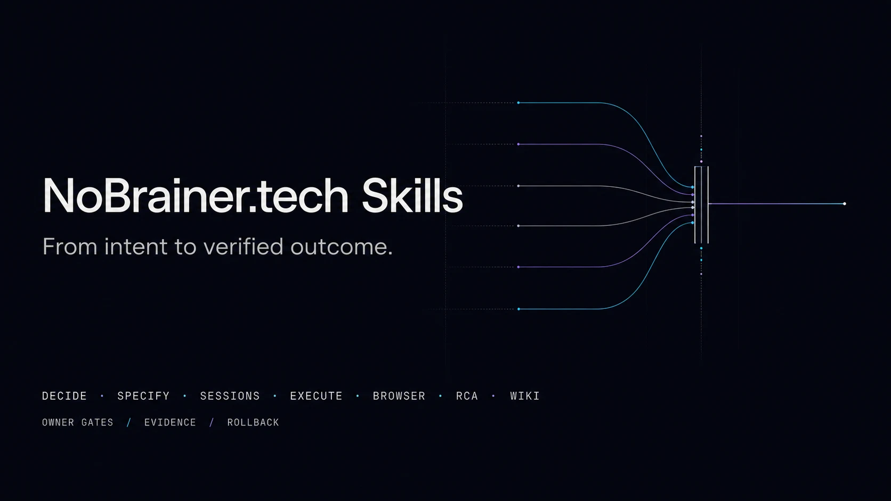

<p align="center">
  <a href="https://nobrainer.tech">
    
  </a>
</p>

<h1 align="center">nobrainer-tech-skills</h1>

<p align="center">
  Portable agentic workflows for fast, visible and evidence-gated delivery.
</p>

<p align="center">
  <a href="https://github.com/nobrainer-tech/nobrainer-tech-skills/actions/workflows/validate.yml"></a>
  <a href="LICENSE"></a>
  <a href="https://github.com/obra/superpowers"></a>
</p>

<p align="center">
  <a href="https://nobrainer.tech">NoBrainer.tech</a>
  ·
  <a href="https://nobrainertech.gumroad.com">NoBrainer workflow blueprints and field guides</a>
</p>

One canonical set of Agent Skills for Claude Code, Codex, Cursor, OpenCode and
GitHub Copilot. The clients get thin adapters; the operational truth stays in
`skills/`.



**Continuous improvement beats delayed perfection.** Start with the smallest
safe workflow, verify the result, keep only durable learning, and improve the
measured bottleneck. A clear daily task stays in one session; specs, a wiki,
extra sessions and evaluation loops appear only when they earn their cost.

NoBrainer is the control plane around delivery: it decides what should happen,
when work is ready, which session owns it, what evidence is required, and when
the workflow must stop. Official Superpowers remains the external implementation
methodology for planning, worktrees, TDD, debugging, review, and verification.

The Karpathy-inspired learning loop stays explicit and inspectable:

- `nobrainer-wiki` compounds sourced project knowledge, decisions and confirmed
  user preferences across sessions;
- `nobrainer-autoimprove` turns repeated corrections or measured gaps into a
  bounded baseline/eval/change/keep-or-revert experiment;
- `nobrainer-ultra` retrieves only relevant knowledge and adapts the workflow,
  without silently rewriting instructions or building an opaque user profile.

## Start here

Use [`nobrainer-ultra`](skills/nobrainer-ultra/) (`nb-ultra`) for a non-trivial
task. It chooses the smallest workflow that can deliver the outcome:

```text
DRIFT_CHECK -> BUDDY -> READY_GATE -> AUTOPILOT -> VERIFY -> RECEIVE_AUDIT
```

- `BUDDY` is a short requirements/decision gate, not a permanent chat mode.
- `AUTOPILOT` executes the approved scope without asking between routine steps.
- A small task stays small: no SDD, wiki, worker or improvement loop by default.
- Visible sessions are added only when handoff, isolation, resume or real
  parallel benefit outweighs coordination cost.
- Merge, deploy, publishing, spending, credentials, destructive actions and
  production mutation remain owner gates.

## Core workflow suite

Aliases are trigger phrases in each description; they are not duplicate skill
directories.

| Skill | Alias | Responsibility |
|---|---|---|
| [`nobrainer-ultra`](skills/nobrainer-ultra/) | `nb-ultra` | End-to-end lifecycle, drift reconciliation, requirements, routing, guarded autonomy and final audit |
| [`nobrainer-sessions`](skills/nobrainer-sessions/) | `nb-sessions` | Visible named sessions, exact identity, checkout/lease ownership, audited handoff and recovery |
| [`nobrainer-spec-driven-development`](skills/nobrainer-spec-driven-development/) | `nb-sdd` | Durable specification, acceptance ledger, change control and rollback for work that justifies SDD |
| [`nobrainer-decide`](skills/nobrainer-decide/) | `nb-decide` | Evidence-based option generation, scorecard, blind attack, cold review and one decision |
| [`nobrainer-rca`](skills/nobrainer-rca/) | `nb-rca` | Adaptive, read-only root-cause analysis with a continuous evidence chain |
| [`nobrainer-autoimprove`](skills/nobrainer-autoimprove/) | `nb-autoimprove` | Baseline/variant/eval/holdout loop with promotion or rollback |
| [`nobrainer-wiki`](skills/nobrainer-wiki/) | `nb-wiki` | Decide, set up and govern a durable Markdown knowledge base |
| [`nobrainer-wiki-add`](skills/nobrainer-wiki-add/) | `nb-wiki-add` | Classified, sanitized and cited ingestion/promotion |
| [`nobrainer-wiki-get`](skills/nobrainer-wiki-get/) | `nb-wiki-get` | Read-only query with provenance, freshness, contradictions and gaps |
| [`nobrainer-wiki-tidy`](skills/nobrainer-wiki-tidy/) | `nb-wiki-tidy` | Audit-first maintenance with deterministic apply gates |

## Compatibility and proof

| Client | Discovery path | Repository evidence | Clean-session runtime |
|---|---|---|---|
| Claude Code | `.claude-plugin/plugin.json` or personal skills | Manifest + conflict-safe local install | Not yet recorded |
| Codex | `.codex-plugin/plugin.json` or personal skills | Manifest, skills path + local install | Not yet recorded for this public package |
| Cursor | `.cursor-plugin/plugin.json` | Manifest and canonical skills path | Not yet recorded |
| OpenCode | git adapter or personal skills | Config hook imported and registered in tests | Not yet recorded |
| GitHub Copilot | native Agent Skills + repo instructions | Personal install + repository routing | Not yet recorded |

Portable source, adapter wiring, clean-session routing, and marketplace
distribution are separate proof levels. See [Compatibility](docs/COMPATIBILITY.md)
for the acceptance transcript required to promote any client to runtime-verified,
and [Installation](docs/INSTALL.md) for client-specific setup and readback.

## Why one repository

Client-specific repositories would duplicate the protocols and drift. This repo
uses the same approach as a well-structured plugin bundle:

```text
skills/              canonical portable skills
.claude-plugin/      Claude packaging
.codex-plugin/       Codex packaging
.cursor-plugin/      Cursor packaging
.opencode/           OpenCode registration adapter
.github/             Copilot repository instructions
```

Archived predecessors remain outside `skills/`, so plugin discovery and the
installer cannot load them.

## Superpowers: complementary, not copied

NoBrainer Tech Skills owns lifecycle, visible sessions, owner gates,
specification contracts, decision/RCA records, measurable improvement and wiki
knowledge. [Official Superpowers](https://github.com/obra/superpowers) owns
implementation methods such as brainstorming, planning, worktrees, TDD,
systematic debugging, review and verification.

Install Superpowers separately for each client. This repository deliberately
does not vendor or rename its skills, preventing duplicate triggers and stale
private wrappers.

## Additional active skills

The curated non-core tools remain available from the same canonical directory:

| Area | Skills |
|---|---|
| Evidence and review | [`deep-audit`](skills/deep-audit/), [`deep-autoreview`](skills/deep-autoreview/), [`deep-bugs-finder`](skills/deep-bugs-finder/) |
| Browser work | [`nobrainer-browser`](skills/nobrainer-browser/) — thin policy around the current Playwright CLI: approved attach, deep inspection, tests and trace analysis; no extra MCP/plugin stack by default |
| Security | [`nobrainer-fast-audit`](skills/nobrainer-fast-audit/), [`nobrainer-npm-secure`](skills/nobrainer-npm-secure/) |
| Agent restraint | [`agents-restraint`](skills/agents-restraint/) |
| Integrations | [`codex-in-claude-code`](skills/codex-in-claude-code/), [`nobrainer-reddit`](skills/nobrainer-reddit/) |

The retired monolithic autopilot, fixed ten-agent RCA, duplicated wiki/memory,
401-agent team builder, old Ultracode and old Karpathy wrapper are absent from
the active tree and remain recoverable from Git history.

## Installation

The commands install the exact Git ref you checked out. Before applying writes,
confirm that checkout contains `skills/nobrainer-ultra/SKILL.md` and
`scripts/validate_skills.py`.

Clone the repository, validate it and dry-run the portable installer:

```bash
git clone https://github.com/nobrainer-tech/nobrainer-tech-skills.git
cd nobrainer-tech-skills
python3 scripts/validate_skills.py --suite
python3 scripts/install_skills.py --client codex
```

The installer writes nothing until `--apply`, refuses to overwrite existing
targets and supports Claude, Codex, OpenCode, Copilot and the shared
`~/.agents/skills` convention. Cursor uses the plugin manifest. Full commands,
Superpowers setup and rollback are in [docs/INSTALL.md](docs/INSTALL.md).

## Quality gates

The core contracts have frozen pressure scenarios and independent review in
[`docs/evals/core-suite-2026-08-27.md`](docs/evals/core-suite-2026-08-27.md),
plus a baseline/candidate setup comparison in
[`docs/evals/setup-upgrade-2026-08-27.md`](docs/evals/setup-upgrade-2026-08-27.md).
These are local contract checks, not production or buyer-outcome proof.
Deterministic repository checks:

```bash
python3 scripts/validate_skills.py
python3 scripts/validate_skills.py --suite
python3 -m unittest discover -s tests -v
```

The validator checks frontmatter, directory/name identity, aliases, public-clean
content, relative links and retired-name exclusion. Behavioral tests remain
necessary: valid Markdown does not prove a workflow makes the right decision.
See [Testing](docs/TESTING.md) for the four evidence layers and CI boundary.

## Design sources and attribution

- `nobrainer-autoimprove` is an independent adaptation of Andrej Karpathy's
  [autoresearch](https://github.com/karpathy/autoresearch) experiment loop.
- `nobrainer-wiki` is an independent adaptation of Andrej Karpathy's
  [LLM wiki note](https://gist.github.com/karpathy/442a6bf555914893e9891c11519de94f).
- Superpowers is created by Jesse Vincent / Prime Radiant and remains an
  external dependency under its own project and license.

## Contributing

Read [CONTRIBUTING.md](CONTRIBUTING.md) and [AGENTS.md](AGENTS.md). Change one
behavioral concern at a time, start with a failing behavior/eval, preserve
public-clean boundaries, run the full local validation, and use a focused branch
and PR. `CLAUDE.md` must remain byte-identical to `AGENTS.md`. Report security
issues through [SECURITY.md](SECURITY.md), not a public issue.

## License

MIT © 2026 NoBrainer.tech
