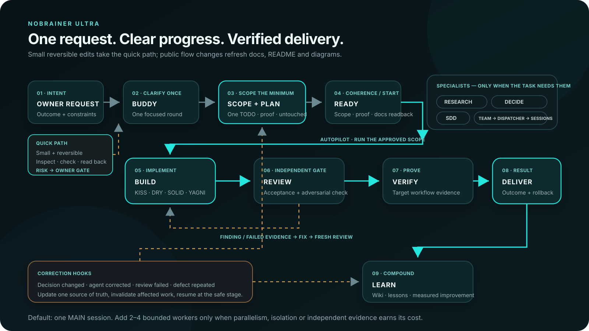
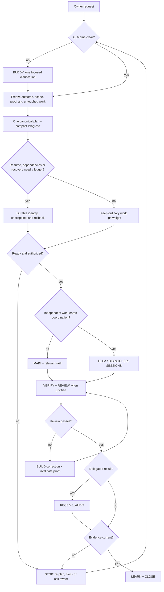

<p align="center">
  <a href="https://nobrainer.tech">
    
  </a>
</p>

<h1 align="center">nobrainer-tech-skills</h1>

<p align="center">
  Lightweight, portable agentic workflows for fast and evidence-gated delivery.
</p>

<p align="center">
  <a href="https://github.com/nobrainer-tech/nobrainer-tech-skills/actions/workflows/validate.yml"></a>
  <a href="LICENSE"></a>
</p>

<p align="center">
  <a href="https://nobrainer.tech">NoBrainer.tech</a>
  ·
  <a href="https://nobrainertech.gumroad.com">Production-ready agentic workflows</a>
</p>

Give the agent one outcome. `nobrainer-ultra` inspects the real project, asks at
most one focused requirements round, scopes the minimum complete change, shows
one short Progress checklist and drives approved work until verified delivery or
a real owner gate. Detailed state and specialists appear only when they earn
their coordination cost.



### GitHub flow chart



**Continuous improvement beats delayed perfection.** A small task stays small.
A non-trivial task gets enough structure to be reliable, but no speculative
framework, automatic swarm or documentation theatre.

## Start with one skill

Use [`nobrainer-ultra`](skills/nobrainer-ultra/) for setup or any non-trivial
outcome. In Codex, explicit invocation is `$nobrainer-ultra`; `nb-ultra` is a
natural-language trigger phrase and therefore depends on a client's implicit
description matching.

```text
DRIFT_CHECK -> BUDDY -> SCOPE -> AUTOPILOT -> VERIFY -> RECEIVE_AUDIT -> LEARN
```

- `BUDDY` is the first and only ordinary clarification stage.
- `SCOPE` freezes outcome, non-goals, expected files, proof, untouched work,
  minimum solution, test decision and clean completion before a non-trivial write.
- One canonical plan owns TODO state; the owner sees only a compact Progress
  checklist and one next action.
- A durable ledger adds exact identity, dependencies, checkpoints, retries and
  rollback only for cross-session, dependency-rich or consequential work.
- `AUTOPILOT` continues through routine approved work without repeated check-ins.
- `nobrainer-team` selects the minimum useful capabilities;
  `nobrainer-dispatcher` schedules only approved ready work in bounded batches;
  `nobrainer-sessions` creates or reuses exact visible sessions only when
  parallelism, isolation, handoff or independent evidence earns the cost.
- Failed review returns to `nobrainer-build`; changed code invalidates old proof.
- Merge, deploy, publishing, spending, credentials, destructive operations and
  production mutation remain owner gates unless exact authority is already
  recorded.

The two execution axes stay independent:

```text
CONTROL_MODE: BUDDY -> AUTOPILOT
SESSION_MODE: MAIN | MULTI_SESSION
```

Autopilot can run in one MAIN session. A multi-session plan is not automatically
autonomous. This keeps the workflow understandable and avoids agent theatre.

## Fifteen skills, distinct ownership

Aliases are trigger phrases, not duplicate directories. Each skill owns one
recurring boundary:

| Skill | Alias | Responsibility |
|---|---|---|
| [`nobrainer-ultra`](skills/nobrainer-ultra/) | `nb-ultra` | End-to-end setup and delivery: one requirements gate, concise progress, bounded execution, recovery, audit and learning |
| [`nobrainer-team`](skills/nobrainer-team/) | `nb-team` | Minimal capability roster, installed-skill inventory and safe temporary specialist discovery |
| [`nobrainer-dispatcher`](skills/nobrainer-dispatcher/) | `nb-dispatcher` | Dependency-aware ready-set scheduling, bounded dispatch, backpressure and audited result routing |
| [`nobrainer-research`](skills/nobrainer-research/) | `nb-research` | Bounded current research from primary sources with facts separated from inference |
| [`nobrainer-writing`](skills/nobrainer-writing/) | `nb-write` | High-signal drafting, compression and editing that preserve meaning, evidence, voice and action |
| [`nobrainer-build`](skills/nobrainer-build/) | `nb-build` | Smallest verified implementation using calibrated KISS, DRY, SOLID, YAGNI and anti-slop gates |
| [`nobrainer-security`](skills/nobrainer-security/) | `nb-security` | Threat models, security review, supply-chain audit and high-risk release evidence |
| [`nobrainer-sessions`](skills/nobrainer-sessions/) | `nb-sessions` | Named visible sessions, exact identity, isolated writers, audited handoff, lease and recovery |
| [`nobrainer-spec-driven-development`](skills/nobrainer-spec-driven-development/) | `nb-sdd` | Durable specification and acceptance ledger when contracts, risk or resumability justify it |
| [`nobrainer-wiki`](skills/nobrainer-wiki/) | `nb-wiki` | Targeted retrieval and sourced durable knowledge without hidden memory or live task state |
| [`nobrainer-browser`](skills/nobrainer-browser/) | `nb-browser` | Playwright-first rendered inspection, approved session attach, browser tests and trace evidence |
| [`nobrainer-autoimprove`](skills/nobrainer-autoimprove/) | `nb-autoimprove` | Measured baseline/variant/eval/holdout improvement with keep-or-revert |
| [`nobrainer-decide`](skills/nobrainer-decide/) | `nb-decide` | Consequential decisions with different-shaped options, scoring, attack and one commitment |
| [`nobrainer-rca`](skills/nobrainer-rca/) | `nb-rca` | Read-only causal diagnosis with a continuous evidence chain and explicit uncertainty |
| [`nobrainer-review`](skills/nobrainer-review/) | `nb-review` | Acceptance trace, adversarial bug hunt and release close gate without speculative findings |

The [curation audit](docs/SKILL_CURATION.md) records why each skill exists and
what belongs in another skill instead of becoming a sixteenth trigger.

## Correct once, improve permanently

Ultra contains portable semantic hooks for four events:

- `OWNER_DECISION_CHANGED` updates the canonical decision, marks the old value
  superseded and invalidates dependent TODO items and evidence;
- `AGENT_ERROR_CORRECTED` fixes the active result and classifies one minimal
  prevention candidate: `AUTO_SCOPED` may persist it to one governed canonical
  project-local store, `ASK` prepares one exact diff, and `OFF` keeps it
  task-local without a durable diff;
- `REVIEW_FAILED` creates a bounded Build correction and sends fresh evidence
  back to Review;
- `REPEATED_DEFECT` stops blind retries and invokes RCA with the prior failure
  fingerprint.

Only durable, sourced, authorized and non-secret knowledge is promoted through
`nobrainer-wiki`. One mutable fact has one canonical owner; the system does not
append contradictory copies to the plan, instructions and wiki.
Project setup records `LEARNING_WRITE_POLICY: AUTO_SCOPED | ASK | OFF`, so an
owner can enable automatic project-local learning without granting global or
publishing authority.

## Quality without AI slop

The shared delivery contract operationalizes:

- `KISS`: the simplest complete design wins;
- `YAGNI`: no speculative extension points or future options;
- `DRY`: deduplicate owned knowledge and state, not incidental similarity;
- `SOLID`: cohesive responsibilities and stable boundaries without class or
  interface ceremony;
- evidence: no invented APIs, fake runtime claims, placeholder logic, swallowed
  errors, generic prose, broad unrelated rewrites or mock-only confidence;
- content quality: purpose, audience, correctness sources, completeness,
  coherence and target-workflow usefulness are frozen before execution.

If a decision-relevant fact may be current, niche, uncertain, high-stakes or
source-attributed, Ultra routes the smallest sufficient check through Research.
A stable local syntax, import, test or configuration error starts from local
evidence instead of an automatic wiki/web detour. If required primary evidence
is unavailable, it says `RESEARCH_BLOCKED` instead of guessing.

## Compatibility is a proof ladder

All clients consume the same `skills/` tree. Thin adapters cover Claude Code,
Codex, Cursor, OpenCode, Gemini CLI, Kimi Code and Pi; the portable Agent Plugin
manifest and project instructions are the fallback for other Agent Skills
consumers.

Compatibility claims use five distinct levels:

```text
SOURCE_VALIDATED -> REPOSITORY_CHECKED -> CLIENT_LOADED
                 -> RUNTIME_VERIFIED -> DISTRIBUTED
```

A valid manifest does not prove clean-session routing. A local test does not
prove production. See [Compatibility](docs/COMPATIBILITY.md) for current proof
and [Testing](docs/TESTING.md) for acceptance evidence.

## Install safely

Clone a reviewed ref, validate it, preview exact targets, then apply:

```bash
(
  set -u
  : "${NB_REVIEWED_COMMIT:?set a reviewed full 40-character commit SHA}"
  test "${#NB_REVIEWED_COMMIT}" -eq 40 || exit 2
  case "$NB_REVIEWED_COMMIT" in *[!0-9a-f]*) exit 2 ;; esac
  git clone --no-checkout https://github.com/nobrainer-tech/nobrainer-tech-skills.git || exit 3
  cd nobrainer-tech-skills || exit 3
  git checkout --detach "$NB_REVIEWED_COMMIT" || exit 3
  test "$(git rev-parse HEAD)" = "$NB_REVIEWED_COMMIT" || exit 3
  python3 scripts/validate_skills.py --suite || exit 4
  python3 scripts/install_skills.py --client codex || exit 4
  python3 scripts/install_skills.py --client codex --apply || exit 4
)
```

Set `NB_REVIEWED_COMMIT` to the exact full commit SHA you reviewed. Tags and
branches are rejected because they can move; every failed gate stops before the
next command.

The installer defaults to all fifteen canonical skills, supports an exact
subset, refuses foreign targets and can use links or copies. Restart the client
and perform clean-session discovery before claiming runtime installation. Full
client-specific steps and rollback are in [Installation](docs/INSTALL.md).

Version [`v1.3.0`](docs/releases/v1.3.0-publication-readback.md) is the latest
fully accepted GitHub source release. It keeps exactly fifteen skills and
records the calibrated Autoimprove final5 holdout, deterministic gates, secret
scan and source distribution readback in the post-release record. The source-tag
candidate checkpoint remains available in [the candidate record](docs/releases/v1.3.0.md).
Client-specific runtime rows remain evidence-scoped; source publication does not
imply marketplace discovery.

Version [`v1.2.1`](docs/releases/v1.2.1.md) remains the rollback source release
at full commit `0010140d19a7ff847dff776569772ef04d82c314`, with its own exact
tag, archive and isolated-install evidence. To reproduce the reviewed v1.3.0
source:

```bash
git checkout --detach 8ae4a26548ce908fc5f98b22663f52e163541f56
test "$(git rev-parse HEAD)" = "8ae4a26548ce908fc5f98b22663f52e163541f56"
python3 scripts/validate_skills.py --suite
python3 -m unittest discover -s tests -q
```

`v1.2.0` remains published but failed archive acceptance; its exact boundary is
[recorded separately](docs/releases/v1.2.0.md). GitHub reports the `v1.2.1`
release object as non-immutable and tag protection was not independently
verified, so security-sensitive consumers should pin the full commit SHA. The
current tag archive was re-read after the metadata-only history rewrite and
passed 88/88 tests; historical CI binds the same tree, not the current commit
identity.
[`v1.1.0`](docs/releases/v1.1.0.md) remains the accepted rollback anchor at full
commit `711be31d654835a04ef8c70674c3e493aeb2da8a`.

## One source, thin adapters

```text
skills/               canonical portable behavior
adapters/bootstrap.md small session-start route to Ultra
hooks/                tested client lifecycle adapters
scripts/              validation and conflict-safe installation
tests/                deterministic and behavior-contract gates
docs/                 compatibility, curation, eval and release evidence
assets/               brand and workflow diagrams
```

Client-specific forks of a skill are prohibited. External skills discovered by
Team are untrusted input: inspect the exact source/ref, instructions, scripts,
permissions, network/credential behavior, trigger overlap and rollback. Prefer
temporary project-scoped use; persistent or global installation is an owner
gate.

## Attribution

- `nobrainer-autoimprove` is an independent adaptation of Andrej Karpathy's
  [autoresearch](https://github.com/karpathy/autoresearch) measure-change-keep
  loop.
- `nobrainer-wiki` is an independent adaptation of Andrej Karpathy's
  [LLM wiki concept](https://gist.github.com/karpathy/442a6bf555914893e9891c11519de94f).
- Other external design sources remain cited inside the exact skill where they
  influenced a behavior contract.

## Contributing and security

Read [CONTRIBUTING.md](CONTRIBUTING.md), [SECURITY.md](SECURITY.md) and
[RELEASE-NOTES.md](RELEASE-NOTES.md). Every change goes through a focused PR,
pressure scenario, validators, diff review and secret scan. Do not report
publication, distribution, live routing or user-visible success without
readback from that layer.

NoBrainer Tech builds practical agentic workflows for teams that want speed
without surrendering control. Learn more at [nobrainer.tech](https://nobrainer.tech)
or browse ready-to-use workflow products on
[Gumroad](https://nobrainertech.gumroad.com).
