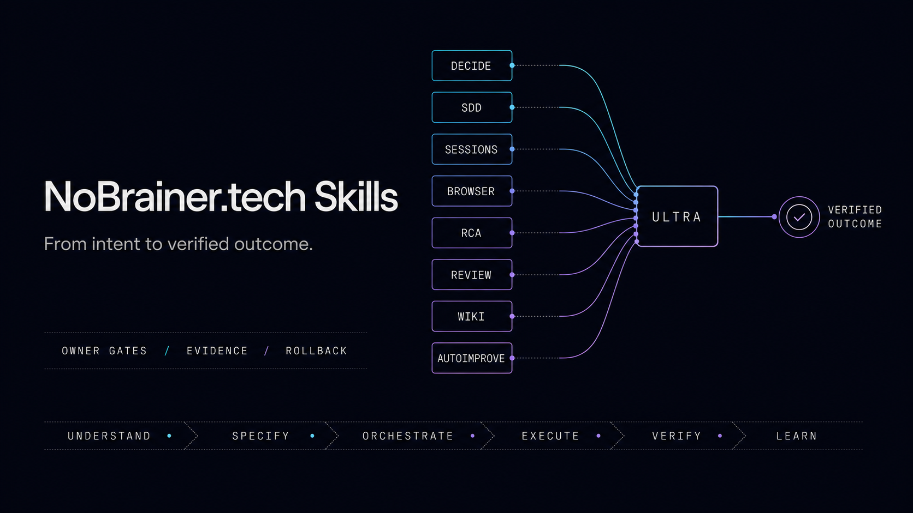

<p align="center">
  <a href="https://nobrainer.tech">
    
  </a>
</p>

<h1 align="center">nobrainer-tech-skills</h1>

<p align="center">
  Portable agentic workflows for fast, visible and evidence-gated delivery.
</p>

<p align="center">
  <a href="https://github.com/nobrainer-tech/nobrainer-tech-skills/actions/workflows/validate.yml"></a>
  <a href="LICENSE"></a>
  <a href="https://github.com/obra/superpowers"></a>
</p>

<p align="center">
  <a href="https://nobrainer.tech">NoBrainer.tech</a>
  ·
  <a href="https://nobrainertech.gumroad.com">NoBrainer workflow blueprints and field guides</a>
</p>

One canonical set of portable Agent Skills. Thin, tested adapters cover Claude
Code, Codex, Cursor, OpenCode, Gemini CLI, Kimi Code and Pi. The root Agent
Plugin manifest and portable folders are the honest fallback for Copilot, Devin,
Hermes and other consumers: automatic bootstrap and runtime behavior are never
claimed without a clean-session readback. Operational truth stays in `skills/`.



**Continuous improvement beats delayed perfection.** Start with the smallest
safe workflow, verify the result, keep only durable learning, and improve the
measured bottleneck. A clear daily task stays in one session; specs, a wiki,
extra sessions and evaluation loops appear only when they earn their cost.

NoBrainer is the control plane around delivery: it decides what should happen,
when work is ready, which session owns it, what evidence is required, and when
the workflow must stop. Official Superpowers remains the external implementation
methodology for planning, worktrees, TDD, debugging, review, and verification.

The Karpathy-inspired learning loop stays explicit and inspectable:

- `nobrainer-wiki` compounds sourced project knowledge, decisions and confirmed
  user preferences across sessions;
- `nobrainer-autoimprove` turns repeated corrections or measured gaps into a
  bounded baseline/eval/change/keep-or-revert experiment;
- `nobrainer-ultra` retrieves only relevant knowledge and adapts the workflow,
  without silently rewriting instructions or building an opaque user profile.

## Start here

Use [`nobrainer-ultra`](skills/nobrainer-ultra/) (`nb-ultra`) for a non-trivial
task. It chooses the smallest workflow that can deliver the outcome:

```text
DRIFT_CHECK -> BUDDY -> READY_GATE -> AUTOPILOT -> VERIFY -> RECEIVE_AUDIT
```

- `BUDDY` is a short requirements/decision gate, not a permanent chat mode.
- `AUTOPILOT` executes the approved scope without asking between routine steps.
- A small task stays small: no SDD, wiki, worker or improvement loop by default.
- Visible sessions are added only when handoff, isolation, resume or real
  parallel benefit outweighs coordination cost.
- Merge, deploy, publishing, spending, credentials, destructive actions and
  production mutation remain owner gates.

## Nine skills, no filler

Aliases are trigger phrases in each description; they are not duplicate skill
directories. The installer adds the complete curated set because every active
skill has a distinct role in normal delivery.

| Skill | Alias | Responsibility |
|---|---|---|
| [`nobrainer-ultra`](skills/nobrainer-ultra/) | `nb-ultra` | End-to-end lifecycle, drift reconciliation, requirements, routing, guarded autonomy and final audit |
| [`nobrainer-sessions`](skills/nobrainer-sessions/) | `nb-sessions` | Visible named sessions, exact identity, checkout/lease ownership, audited handoff and recovery |
| [`nobrainer-spec-driven-development`](skills/nobrainer-spec-driven-development/) | `nb-sdd` | Durable specification, acceptance ledger, change control and rollback for work that justifies SDD |
| [`nobrainer-wiki`](skills/nobrainer-wiki/) | `nb-wiki` | One LLM-wiki owner with explicit setup, read-only query, durable capture and audit/apply modes |
| [`nobrainer-browser`](skills/nobrainer-browser/) | `nb-browser` | Playwright-first rendered UI inspection, approved session attach, tests and trace evidence |
| [`nobrainer-autoimprove`](skills/nobrainer-autoimprove/) | `nb-autoimprove` | Baseline/variant/eval/holdout loop with promotion or rollback |
| [`nobrainer-decide`](skills/nobrainer-decide/) | `nb-decide` | Evidence-based option generation, scorecard, blind attack, cold review and one decision |
| [`nobrainer-rca`](skills/nobrainer-rca/) | `nb-rca` | Adaptive, read-only root-cause analysis with a continuous evidence chain |
| [`nobrainer-review`](skills/nobrainer-review/) | `nb-review` | Acceptance trace, adversarial bug search, verified findings and pre-merge/release close gates without review slop |

The rationale and retirement rules for every active skill are recorded in the
[skill curation audit](docs/SKILL_CURATION.md).

## Compatibility and proof

| Client / harness | Discovery and bootstrap | Repository evidence | Clean-session runtime |
|---|---|---|---|
| Claude Code | plugin skills + standard session hook | Manifest parsed; exact hook JSON tested | Not yet recorded |
| Codex | `.codex-plugin` skills; native routing | Manifest + conflict-safe local install | Not yet recorded for this public package |
| Cursor | plugin skills + Cursor session hook | Manifest and exact hook JSON tested | Not yet recorded |
| OpenCode | config registration + first-user bootstrap | Import, idempotence and one-injection tests | Not yet recorded |
| GitHub Copilot CLI | personal Agent Skills + repository instructions | Installer and instructions tested; no automatic bootstrap claim | Not yet recorded |
| Gemini CLI | extension context include | Manifest and include target parsed | Not yet recorded |
| Kimi Code | plugin skills + `nobrainer-ultra` session start | Manifest and tool-boundary contract tested | Not yet recorded |
| Devin CLI | portable Agent Skills source only | Canonical inventory validated; no dedicated adapter | Not yet recorded |
| Pi | package resources + lifecycle context extension | Discovery, dedupe and post-compaction tests | Not yet recorded |
| Hermes Agent | root Agent Plugin + portable skills | Standard root manifest parsed; no automatic bootstrap claim | Not yet recorded |

Portable source, repository adapter checks, client loading, clean-session
behavior and marketplace distribution are separate proof levels. See
[Compatibility](docs/COMPATIBILITY.md)
for the acceptance transcript required to promote any client to runtime-verified,
and [Installation](docs/INSTALL.md) for client-specific setup and readback.

## Why one repository

Client-specific repositories would duplicate the protocols and drift. This repo
uses the same approach as a well-structured plugin bundle:

```text
skills/              canonical portable skills
adapters/            one small shared bootstrap, not a tenth skill
plugin.json           portable Agent Plugins v1 metadata
hooks/               tested Claude and Cursor session hooks
.claude-plugin/      Claude packaging
.codex-plugin/       Codex packaging
.cursor-plugin/      Cursor packaging
.opencode/           OpenCode registration and bootstrap adapter
.kimi-plugin/        Kimi discovery and native-tool boundaries
.pi/                 Pi discovery and compaction-aware bootstrap
gemini-extension.json + GEMINI.md
                     Gemini extension and owned context include
.github/             repository instructions, contribution surfaces and CI
```

Retired predecessors exist only in Git history, so plugin discovery and the
installer expose only the nine canonical skills.

## Superpowers: complementary, not copied

NoBrainer Tech Skills owns lifecycle, visible sessions, owner gates,
specification contracts, decision/RCA records, measurable improvement and wiki
knowledge. [Official Superpowers](https://github.com/obra/superpowers) owns
implementation methods such as brainstorming, planning, worktrees, TDD,
systematic debugging, requesting/receiving implementation review and
verification. `nobrainer-review` owns the final evidence-gated finding contract,
not another implementation framework.

Install Superpowers separately for each client. This repository deliberately
does not vendor or rename its skills, preventing duplicate triggers and stale
private wrappers.

## Specialist discovery without permanent bloat

NoBrainer Ultra first checks this complete curated set and the task's native
tool. Only a real capability gap may route to the open
[`skills` CLI](https://github.com/vercel-labs/skills):

```bash
npx skills find "$SKILL_QUERY"
npx skills use "$SKILL_SOURCE@$SKILL_NAME"
```

`skills use` is preferred for one-off evaluation because it does not make a
permanent installation. External skills are untrusted input: inspect the exact
source/ref, `SKILL.md`, scripts, license, write scope and secret/network behavior
before use. Persistent or global installation remains an explicit owner gate.
There is deliberately no separate NoBrainer “find skills” wrapper; discovery is
a fallback inside `nobrainer-ultra`, not another always-installed trigger.

The retired monolithic autopilot, fixed ten-agent RCA, duplicated wiki helpers,
custom multi-review harnesses, client/account integrations, broad security
catalog, 401-agent team builder, old Ultracode and old Karpathy wrappers are
absent from the active tree and remain recoverable from Git history.

## Installation

The commands install the exact Git ref you checked out. Before applying writes,
confirm that checkout contains `skills/nobrainer-ultra/SKILL.md` and
`scripts/validate_skills.py`.

After publication, clone the versioned `v1.0.0` source tag, validate it and
dry-run the portable installer:

```bash
git clone --branch v1.0.0 --depth 1 https://github.com/nobrainer-tech/nobrainer-tech-skills.git
cd nobrainer-tech-skills
python3 scripts/validate_skills.py --suite
python3 scripts/install_skills.py --client codex
python3 scripts/install_skills.py --client codex --apply
```

The portable installer writes all nine curated skills, and nothing else, unless
repeated `--skill NAME` flags request an exact subset. It writes nothing until
`--apply`, refuses to overwrite existing targets and supports Claude, Codex,
OpenCode, Copilot and the shared `~/.agents/skills` convention. Other harnesses
use a named adapter when one exists, otherwise the canonical folders or root
Agent Plugin without a bootstrap claim. Full commands, proof boundaries,
Superpowers setup, dynamic discovery and rollback are in
[docs/INSTALL.md](docs/INSTALL.md).

See [release notes](RELEASE-NOTES.md) for the exact v1 scope, evidence and
distribution limits.

## Quality gates

The core contracts have frozen pressure scenarios and independent review in
[`docs/evals/core-suite-2026-08-27.md`](docs/evals/core-suite-2026-08-27.md),
plus a baseline/candidate setup comparison in
[`docs/evals/setup-upgrade-2026-08-27.md`](docs/evals/setup-upgrade-2026-08-27.md).
The adapter and product-surface parity audit against Superpowers v6.3.0 is in
[`docs/evals/superpowers-parity-2026-08-28.md`](docs/evals/superpowers-parity-2026-08-28.md).
These are local contract checks, not production or buyer-outcome proof.
Deterministic repository checks:

```bash
python3 scripts/validate_skills.py
python3 scripts/validate_skills.py --suite
python3 -m unittest discover -s tests -v
```

The validator checks frontmatter, directory/name identity, aliases, public-clean
content, relative links and retired-name exclusion. Behavioral tests remain
necessary: valid Markdown does not prove a workflow makes the right decision.
See [Testing](docs/TESTING.md) for the four evidence layers and CI boundary.

## Design sources and attribution

- `nobrainer-autoimprove` is an independent adaptation of Andrej Karpathy's
  [autoresearch](https://github.com/karpathy/autoresearch) experiment loop.
- `nobrainer-wiki` is an independent adaptation of Andrej Karpathy's
  [LLM wiki note](https://gist.github.com/karpathy/442a6bf555914893e9891c11519de94f).
- Superpowers is created by Jesse Vincent / Prime Radiant and remains an
  external dependency under its own project and license.

## Contributing

Read [CONTRIBUTING.md](CONTRIBUTING.md) and [AGENTS.md](AGENTS.md). Change one
behavioral concern at a time, start with a failing behavior/eval, preserve
public-clean boundaries, run the full local validation, and use a focused branch
and PR. `CLAUDE.md` must remain byte-identical to `AGENTS.md`. Report security
issues through [SECURITY.md](SECURITY.md), not a public issue.

## License

MIT © 2026 NoBrainer.tech
